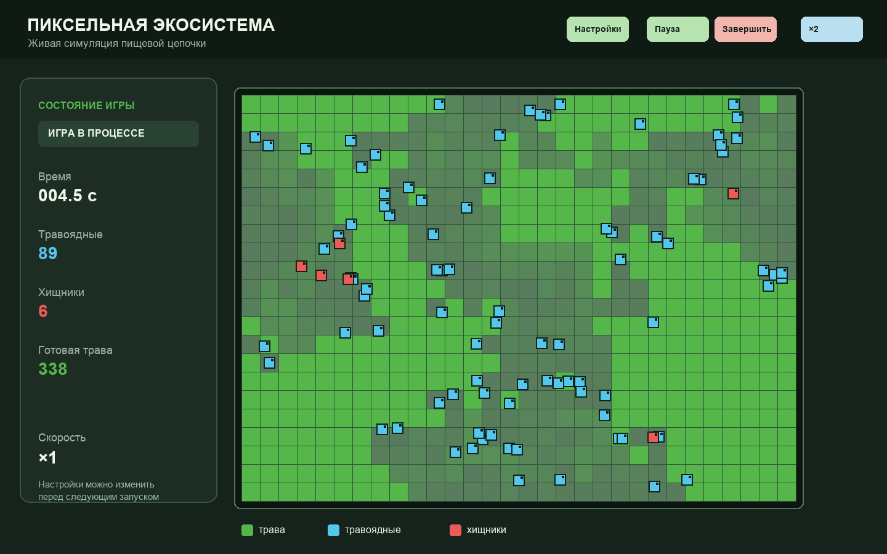

# Пиксельная экосистема

Небольшая симуляция пищевой цепочки на Python и `tkinter`.

## Запуск

### Готовые приложения

После публикации тега готовые самостоятельные приложения появляются на [странице Releases](https://github.com/AmKovylyaev/Game_Live/releases). Для их запуска не нужны Python, `uv` или исходный код.

| Система | Файл в Release | Как запустить |
| --- | --- | --- |
| macOS (Apple Silicon) | `PixelEcosystem-macos-arm64.zip` | Распакуйте архив и дважды кликните `PixelEcosystem.app`. |
| macOS (Intel) | `PixelEcosystem-macos-x64.zip` | Распакуйте архив и дважды кликните `PixelEcosystem.app`. |
| Windows (x64) | `PixelEcosystem-windows-x64.zip` | Распакуйте архив и дважды кликните `PixelEcosystem.exe`. |
| Linux (x64) | `PixelEcosystem-linux-x64.tar.gz` | Распакуйте архив и запустите файл `PixelEcosystem`. |

Сборки пока не подписаны сертификатами разработчика. Поэтому macOS может попросить открыть приложение через контекстное меню, а Windows — подтвердить запуск в SmartScreen.

### Из исходников

```bash
uv run python main.py
```

## Игровой процесс



Кадр показывает живое состояние симуляции: трава восстанавливается, травоядные ищут еду, а хищники охотятся.

## Структура проекта

```text
main.py                 # единая точка запуска
ecosystem/
  settings.py           # настройки и JSON-хранилище
  animals.py            # классы Animal, Herbivore и Predator
  grass.py              # состояние и восстановление травы
  simulation.py         # правила и игровой цикл симуляции
  ui/
    app.py              # окна, настройки и график
    renderer.py         # экономная отрисовка canvas
.github/workflows/
  quality.yml           # линтер и тесты
  release.yml           # сборка macOS, Windows и Linux
```

Внутри симуляции готовая и растущая трава отслеживаются отдельными множествами, а canvas-объекты не пересоздаются каждый кадр — это снижает нагрузку на больших полях.

Перед началом игры задаются ширина и высота поля, а также стартовое количество травоядных и хищников.

Все параметры выбираются ползунками и сохраняются в `settings.json` между запусками игры и приложения:

- размер поля и стартовое количество животных;
- время до смерти от голода для травоядных и хищников — от 5 до 15 секунд;
- скорость передвижения травоядных и хищников.
- скорость восстановления травы;
- отдельный коэффициент размножения для травоядных и хищников: `1.0` — один обычный детёныш, меньшие значения дают шанс размножения, большие могут создавать несколько детёнышей;

В самостоятельных приложениях настройки хранятся вне установленной программы: в `Application Support` на macOS, `AppData` на Windows и `.config` на Linux.

Настройки собраны в три карточки: среда, травоядные и хищники. Текущее значение выделено контрастной меткой прямо над ползунком, а минимальное и максимальное — под ним. Изменения сохраняются автоматически; кнопка «Сбросить» возвращает значения по умолчанию. После клика по ползунку его значение можно менять стрелками клавиатуры.

- зелёный квадрат — трава;
- голубой квадрат — травоядное животное;
- красный квадрат — хищник.

Травоядные идут к одной из пяти ближайших клеток травы, хищники — к одному из пяти ближайших травоядных. Цель выбирается случайно с вероятностями, обратно пропорциональными расстоянию. Травоядное погибает после 15 секунд без еды, хищник — после 12 секунд. Травоядное делится после 3 съеденных клеток травы за 5 секунд, хищник — после 2 жертв за 10 секунд, а после охоты отдыхает 1 секунду.

Чтобы нагрузка и потребление памяти оставались предсказуемыми, популяции ограничены 600 травоядными и 300 хищниками. Это вдвое выше максимальных начальных значений в настройках (300 и 150).

Съеденная трава восстанавливается за выбранное время только рядом с уже созревшей травой. С небольшой вероятностью клетка может самостоятельно начать такой же постепенный рост. Клетка меняет цвет пятью заметными ступенями от приглушённого зелёного к насыщенному. После еды травоядное на 1,5 секунды ускоряется на 25%, а хищник на 1 секунду замедляется вдвое.

Игра завершается только после исчезновения одного из видов. Если остаются только травоядные, они должны съесть всю траву. Если остаются только хищники, игра завершается через 2,5 секунды без видимого обратного отсчёта. После завершения показывается общий график численности травоядных и хищников во времени.

В игровом окне доступны кнопки принудительного завершения с переходом к графику и ускорения времени `▶ ×2`.

## Сборка релизов

Workflow **Build desktop apps** собирает самостоятельные приложения для macOS (Apple Silicon и Intel), Windows и Linux. В pull request и при ручном запуске workflow файлы доступны как GitHub Actions artifacts. При push тега `v*` workflow создаёт или обновляет GitHub Release и прикладывает к нему четыре архива.

Тег следует создавать из `main` после слияния PR:

```bash
git tag -a v0.1.0 -m "v0.1.0"
git push origin v0.1.0
```

## Разработка

Для проверок проекта нужна Python 3.12+:

```bash
uv sync --group dev
uv run pytest
uv run ruff check .
uv run ruff format --check .
```

Эти же проверки выполняет GitHub Actions при каждом push и pull request.

### Замер скорости отрисовки

Чтобы измерить именно работу `tkinter.Canvas` без затрат на поиск целей в симуляции, запустите:

```bash
uv run python -m benchmarks.render
```

Команда создаёт максимальную сцену: поле `100 × 70`, 300 травоядных, 150 хищников и 1 400 растущих клеток травы. Она выводит время первого кадра, медиану и 95-й перцентиль времени отрисовки. Окно по умолчанию скрыто; для визуального запуска добавьте `--show`.

### Замер поиска целей

Чтобы сравнить точный поиск пяти ближайших целей через пространственный индекс с полным просмотром мира, запустите:

```bash
uv run python -m benchmarks.target_search
```

Команда создаёт поле `100 × 70` с 300 травоядными и 150 хищниками, проверяет совпадение результатов обоих алгоритмов и выводит медиану, 95-й перцентиль и среднее число просмотренных кандидатов.
